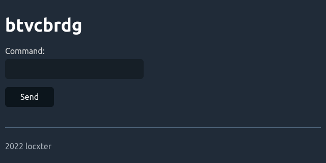
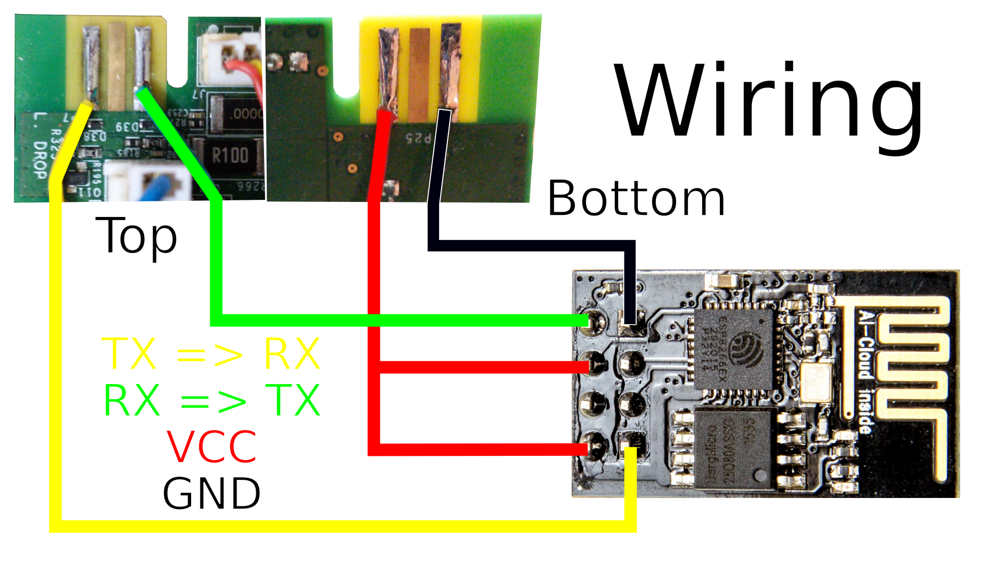

# btvcbrdg

## Overview

This is an ESP8266 bridge for communicating to Neato Botvac robot vacuums over the network.

## Dependencies

I generally try to minimize dependencies, but I'm a one man crew and can therefore only support Ubuntu/Debian as I'm running it myself. Anyway, you need to have the following packages installed for everything to work properly:

- Arduino IDE as a way to compile the Arduino code. Install it with `sudo apt install arduino`.
- Arduino ESP8266 LittleFS uploader for uploading the data. Install it via the [installation guide](https://github.com/earlephilhower/arduino-esp8266littlefs-plugin).

## How to build it

After flashing the firmware to the ESP and opening your vacumm robot, find the three golden soldering pads in the top left of the mainboard and solder wires between them and the ESP as shown in the wiring diagram above. That is it!

## How to use it

After turning on your Botvac and giving the ESP roughly half a minute to boot up, you can send `POST` requests with basic authentication and the `command` form field to talk to your vacuum robot. Alternatively you can also simply open it's web interface and send commands through it.